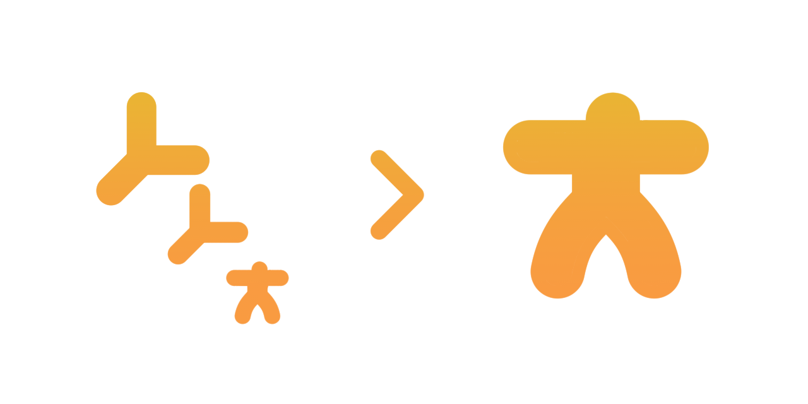

<h1 align="center">FBX Rerooter</h1>
<p align="center">A simple tool for re-rooting your FBX skeletons.</p>

## Why This Exists

When exporting models or animations from the Unity Editor, the FBX Exporter often excludes root motion bones of a skeleton from the bone hierarchy itself since the root motion bone usually doesn't carry any weights to any skinned meshes. The test file, `test/Skeleton.fbx`, demonstrates this hierarchy:

```
Skeleton (Null)
└─ Root (Null)
   └─ Hips (LimbNode)
      └─ Spine (LimbNode)
         └─ Chest (LimbNode)
            └─ Neck (LimbNode)
```

The skeleton starts at `Hips`, not `Root`. `Root` is excluded from the skeleton, which should not be the case. If you want to retain the root motion (especially for retargeting purposes), you'll have to reconstruct the root motion bone within the skeleton and transfer the motion from the parent node.

To solve this, this tool inspects the FBX skeleton hierarchy and can promote any null node to a skeleton root node.

## Usage

```
fbx-reroot [OPTIONS] SUBCOMMAND
```

All examples below use the test file `test/Skeleton.fbx`.

### `find`

Lists all skeleton roots in the FBX file.

```bash
fbx-reroot find test/Skeleton.fbx
```

**Output:**
```
Hips
```

You can also use the `-t,--tree` option to show the full ancestor path of each skeleton root node (comma-separated):

```bash
fbx-reroot find -t test/Skeleton.fbx
```

**Output:**
```
Skeleton,Root,Hips
```

This shows that `Hips` is the current skeleton root.

---

### `make-root`

Promotes a null node to a skeleton root. Two modes are available.

#### Promote a specific node (`--to-node`)

Use the `--to-node` option to specify which null node should become a skeleton root.

```bash
fbx-reroot make-root test/Skeleton.fbx --to-node Root -o test/Skeleton_rerooted.fbx
```

Optionally, you can use the `--from-node` option to specify an existing root to "move" the root from. 

**Output:**
```
Converted 'Root' to a Skeleton root node.
Wrote 'test\Skeleton_rerooted.fbx'.
```

Verify the result:

```bash
fbx-reroot find -t test/Skeleton_rerooted.fbx
```

**Output:**
```
Skeleton,Root
```

`Root` is now the new skeleton root.

#### Walk up from an existing root (`--from-node` + `--to-parent`)

Walk up `N` levels from an existing skeleton root and make that ancestor the new root:

```bash
fbx-reroot make-root test/Skeleton.fbx --from-node Hips --to-parent 1 -o test/Skeleton_rerooted.fbx -y
```

Given the hierarchy `Skeleton,Root,Hips`, walking up 1 level from `Hips` reaches `Root`, which becomes the new skeleton root.

#### Common options

| Option                | Description                                                   |
| --------------------- | ------------------------------------------------------------- |
| `-o, --output <path>` | Output FBX file path (default: `<input>` in CWD)              |
| `-f, --format <fmt>`  | Output format: `auto`, `ascii`, or `binary` (default: `auto`) |
| `-y, --yes`           | Skip the overwrite confirmation prompt                        |

## Building

### Prerequisites

- CMake 3.20+
- C++20 compiler (MSVC, Clang)
- [Autodesk FBX SDK](https://aps.autodesk.com/developer/overview/fbx-sdk) (2020.3.x or later)

### Configure & build

```bash
# Windows (MSVC, x64)
cmake --preset win-x64 -DFBX_SDK_DIR="C:/Program Files/Autodesk/FBX/FBX SDK/2020.3.9"
# Debug or Release build
cmake --build --preset win-x64 --config Debug
cmake --build --preset win-x64 --config Release

# Linux (Clang, x64)
cmake --preset linux-x64 -DFBX_SDK_DIR="/opt/fbx-sdk"
cmake --build --preset linux-x64
```

## License

MIT